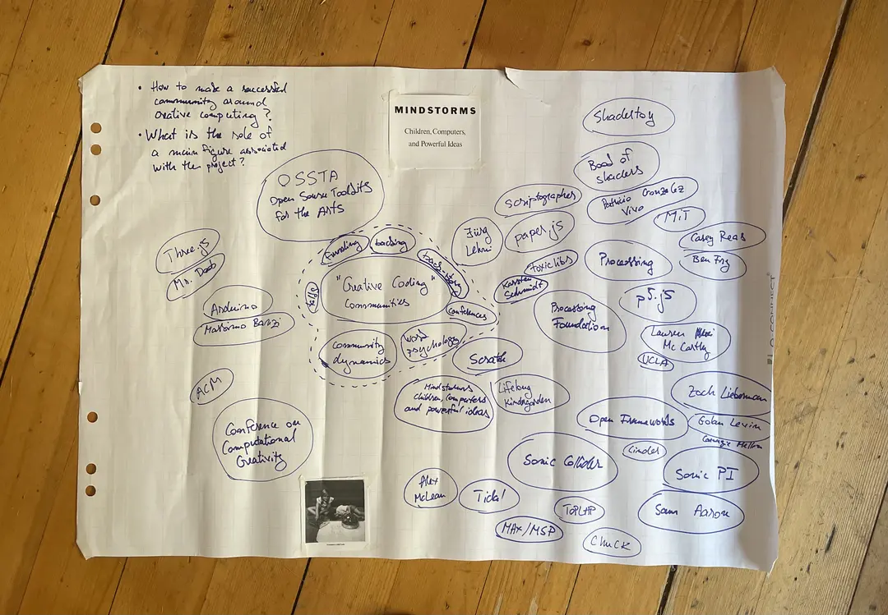

# Inspiration

> Here: upload (1) a .md file with a list of terms/topics and their definition and 3 potential research questions, (2) at least 10 academic resources (articles, book chapters) about your topics, (3) visuals about what you are interested in.

## Terms and topics

* Communities of practice
* Open Source Software Toolkits for the Arts (OSSTA) - post a definition as (Lee McCarthy et al., 2021)
* Virtual Communities

Communities of practice
* Through the prism of learning

Open Source Software Toolkits for the Arts (OSSTA)
Creative Coding Communities
Open source software (OSS)

topic 2
topic 3

How are they organised? Around tools? Communities around tools and making?

* Listing of main open source communities
Definitions. Depend to a large extent on individual contributions, instead of a large structure.

Possible communities
* Processing
* p5.js
* Cinder
* openFrameworkds
* three js

* Three js
* Scratch
* Arduino
* Raspberry PI

* Sonic Collider
* TOPLAP
* Chuck
* Max MSP
* Tidal Cycles
* Open Frameworks
* Cinder

Graphic Tools
* VVVV
* 

Commercial Game Engines
* Unity Engine
* Unreal Engine

Connections between learning

research question 1
rq2
rq3

Conferences
* 

## Academic Resources

## visuals about what you are interested in

