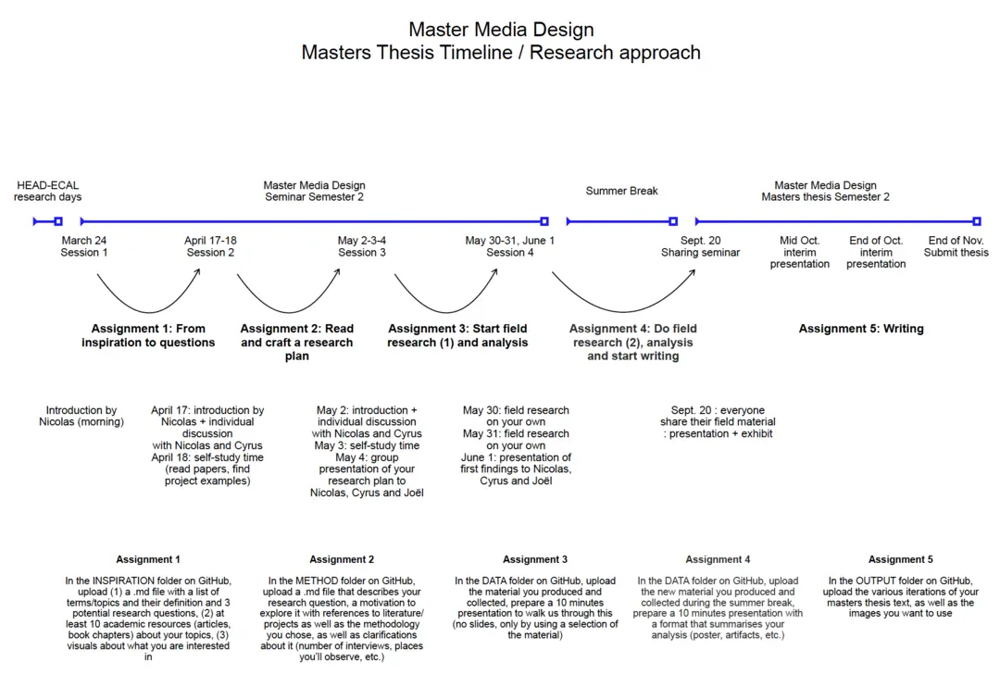

# MD2 Thesis – Creative Coding Communities

Character count command (without spaces)
```
pdftotext main.pdf - | iconv -c -t ASCII//TRANSLIT |tr -d " " | wc -m
```

## Organisation

```
INSPIRATION
METHOD
DATA
OUTPUT
```
These folders correspond to the following:

In the **INSPIRATION** folder on GitHub, upload (1) a .md file with a list of terms/topics and their definition and 3 potential research questions, (2) at least 10 academic resources (articles, book chapters) about your topics, (3) visuals about what you are interested in.

In the **METHOD** folder on GitHub, upload a .md file that describes your research question, a motivation to explore it with references to literature/ projects as well as the methodology you chose, as well as clarifications about it (number of interviews, places you’ll observe, etc.)

In the **DATA** folder on GitHub, upload the material you produced and collected, prepare a 10 minutes presentation to walk us through this (no slides, only by using a selection of the material)

In the **OUTPUT** folder on GitHub, upload the various iterations of your masters thesis text, as well as the images you want to use

## Additional Resources
[Miro Board](https://miro.com/app/board/uXjVMaslHTI=/?share_link_id=310375932515)

## Schedule
